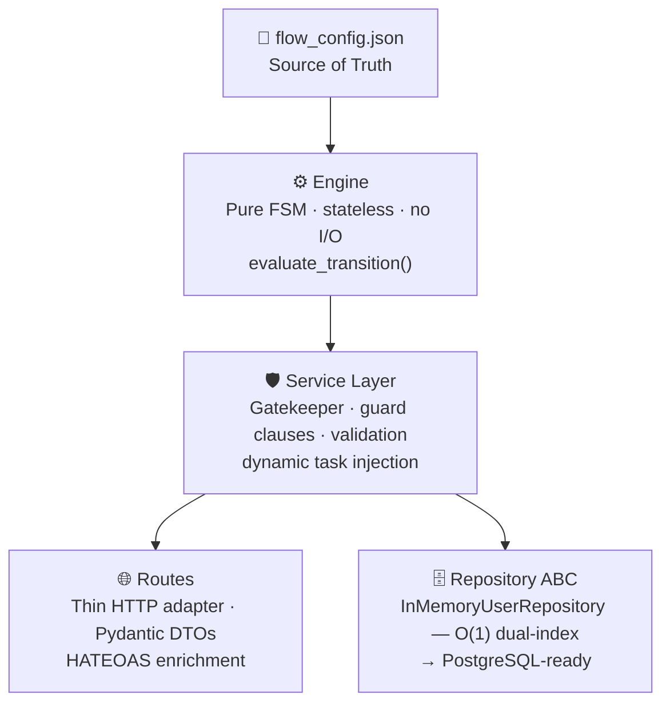

# Masterschool Admissions Engine


Masterschool Admissions Engine is a **Metadata-Driven Finite State Machine** that governs the full candidate admissions lifecycle  from first registration to final acceptance or rejection. Every routing rule, pass/fail threshold, and step sequence lives in a single JSON file. The Python application is a pure execution engine: it reads the configuration and enforces it. Neither the engine nor the service layer contains a single hardcoded business rule.

---

## Table of Contents

1. [Project Philosophy](#1-project-philosophy)
2. [Developer Experience Suite](#2-developer-experience-suite)
3. [Quick Start](#3-quick-start)
4. [Architecture](#4-architecture)
5. [API Reference](#5-api-reference)
6. [Testing](#6-testing)
7. [Configuration Reference](#7-configuration-reference)

---

## 1. Project Philosophy

The central design challenge of this assignment is **PM flexibility**: product managers must be able to iterate on the admissions funnel—adding steps, changing thresholds, or reordering tasks—without a single line of engineering involvement. 

### From Hardcoded Logic to a Directed Graph (FSM)
Most traditional systems fall into the "Hardcoding Trap," where business rules are buried inside nested `if-else` blocks and switch statements. **Masterschool Admissions Engine** rejects this approach. Instead, we treat the admissions funnel as a **Metadata-Driven Directed Graph (Finite State Machine)**.

* **The Config is the Map:** `flow_config.json` defines the "Nodes" (Tasks) and the "Edges" (Transitions/Conditions) of the graph.
* **The Code is the Engine:** The Python application contains zero business rules. It is a pure execution engine that traverses the graph based on real-time metadata. 

By decoupling the **Execution Engine** from the **Business Logic**, we achieve a system where the flow can be completely redesigned simply by updating the graph's configuration. No `if-else` refactoring, no code changes, and no risk of breaking core logic during a business pivot.


> **Proof of Concept: The "Second-Chance IQ"**
> To demonstrate the power of this graph-based architecture, we implemented the "Second Chance" requirement. When a candidate scores between 60–75 on the IQ test, the system dynamically injects a new node into their personalized graph. 
> 
> This complex logic—which would typically require new conditional branches in a standard app—was achieved with **zero Python changes**. It was implemented entirely by adding a transition rule in the JSON with `"inject_to_custom_flow": true`.

### Why This Matters
This architecture ensures that the system is **future-proof**. Whether the PM wants to add a 10th step or a complex branching path based on an interview score, the engineering requirement remains the same: **Update the JSON, restart the service, and the engine will follow the new map.**

---

## 2. Endpoint Test With Developer Experience Suite

The entire DX ecosystem — API, visual portal, and CLI explorer — runs **inside Docker**. This suite was designed as a production-grade internal toolkit for both the reviewer and our engineering team to validate, debug, and explore the system's dynamic capabilities without any local setup.

###  Level 1: Endpoint documentation in Swagger UI — `http://localhost:8000/docs`
**The Primary Evaluation Interface.**
This is where the reviewer should start to verify the API's core logic. 
* **Dynamic Cheat Sheet:** Features a custom-styled, collapsible "Read This First" panel with **9 copy-pasteable task payloads**. 
* **Zero-Manual Sync:** All examples are generated dynamically from `flow_config.json` at startup. If a pass-condition or a schema changes in the JSON, the documentation updates itself instantly. It covers every edge case (e.g., IQ scores > 75, 60–75, < 60) and task type

> **🎬 Watch a brief walkthrough demonstrating how the dynamic Cheat Sheet allows for testing the entire 9-task funnel in seconds:**
> [Watch Swagger UI Demo](https://github.com/user-attachments/assets/1c76335f-5caf-470b-9e53-6136863a3d8c)


### Level 2: API Explorer CLI — `make run-explorer`
**The Power-User Sandbox & Debugger.**
An interactive terminal menu driven by `questionary` that allows for rapid manual testing and inspection of the Finite State Machine (FSM).
* **JIT Schema Discovery:** The CLI provides **Just-In-Time (JIT)** hints for the current task’s schema, pulling the contract directly from the API response.
* **Full Transparency:** Provides immediate visibility into the **Response Body** and clear **Error Messages** (400/422/404) returned by the server. It is the best tool to verify transition rules and payload validations in seconds.

### Level 3: Candidate Portal — `make run-portal`
**The Reference Implementation & UI Simulation.**
A Streamlit-powered wizard (`http://localhost:8501`) that demonstrates how the API's **HATEOAS-based logic** is translated into a functional user experience.
* **The "Dumb Client" Architecture:** The portal has zero hardcoded knowledge of the admissions steps. It is a pure consumer that discovers the progress bar state, step labels, and payload schemas exclusively from the API's `_links` and `current_task_schema`.
* **Payload Insight:** For verification, the UI displays the exact JSON payload being sent in each step, serving as a live integration guide for any frontend consumer.

> **💡 Flexibility Verification:** All three tools are 100% synchronized via `flow_config.json`. To test the system's true dynamic nature, modify a step name, change a pass-condition score, or add a task in the JSON file. Upon restart, the Swagger examples, CLI menus, and Portal progress bar will **instantly adapt**, proving our "Discovery & HATEOAS" architecture works flawlessly across any interface.

## 3. Quick Start

**Prerequisites:** Docker and Docker Compose. Nothing else.

```bash
git clone https://github.com/YairBenDavid-cs/Masterschool---Admissions-process.git
cd Masterschool---Admissions-process
make run          # build image, start API at http://localhost:8000
```

| Command                  | Description                                          |
|--------------------------|------------------------------------------------------|
| `make run`               | Build Docker image and start the API on `:8000`      |
| `make stop`              | Stop and remove all containers                       |
| `make run-portal`        | Launch the Streamlit Candidate Portal on `:8501`     |
| `make run-explorer`      | Launch the interactive CLI API Explorer              |
| `make test`              | Run the full test suite (unit + integration + E2E)   |
| `make test-unit`         | Run only unit tests (fast, no HTTP stack)            |
| `make test-integration`  | Run only integration tests                          |
| `make test-E2E`          | Run only end-to-end journey tests                    |
| `make coverage`          | Full suite with terminal coverage report             |

---

## 4. Architecture



### The Engine — Pure FSM

`app/core/engine.py` contains a single exported function: `evaluate_transition(task_blueprint, payload) -> TransitionRule`. It accepts a task definition loaded from the config and the submitted payload, evaluates transition conditions sequentially (first match wins), and returns the routing decision. It has **no knowledge of Masterschool's business domain** — it knows nothing about IQ scores, interviews, or contracts.

Conditions are Python expression strings sourced from JSON and evaluated with a restricted `eval()` that exposes only the `payload` variable. Every task must declare a `DEFAULT` fallback; the engine raises `EngineEvaluationError` if none exists, enforcing exhaustive transition coverage.

### The Service Layer — The Gatekeeper

`app/services/admissions.py` is the orchestration layer and the only place where business state decisions are enforced. Before calling the engine it runs a strict guard sequence:

1. **Terminal state guard** — rejects any request for an already ACCEPTED or REJECTED user.
2. **Anti-cheat guard** — validates that `step_name` + `task_name` matches the user's current position. Prevents replay attacks and out-of-order submissions.
3. **Multi-layer payload validation** — Pydantic validates the request envelope; `jsonschema` validates the task payload against the schema declared in `flow_config.json`.

Only after all guards pass does the service invoke the engine, apply the returned `TransitionRule`, and optionally inject dynamic tasks into the user's `custom_flow`.

### Routes & HATEOAS

The API layer (`app/api/routes.py`) is intentionally thin — FastAPI dependency injection, Pydantic serialization, HTTP status mapping. All business logic is delegated downward.

Every response includes a full HATEOAS payload: the `step_name`, `task_name`, `current_task_schema` (the exact payload contract for the next task), and `_links` (self + next action). **Any frontend can drive the entire admissions flow with zero hardcoded knowledge** — it follows the links and submits to the schema provided in each response.

### Persistence — Strategic In-Memory Design

`app/repository/base.py` defines `UserRepository`, an Abstract Base Class with three methods: `save_user`, `get_user`, and `get_user_by_email`. All service-layer code targets this interface exclusively — no concrete implementation leaks upward.

`app/repository/in_memory.py` provides the concrete implementation: two dictionaries (primary ID index + secondary email index) delivering **O(1) lookup on both axes** with zero serialization overhead. This is a deliberate architectural choice — zero-friction setup, no infrastructure dependencies, and performance characteristics that scale well under evaluation load.

> **Database-Ready by Design:** Migrating to PostgreSQL requires one new class implementing the `UserRepository` interface and a one-line update to the `get_repo()` FastAPI dependency. The engine, service layer, and routes require zero modification.

---

## 5. API Reference

| Method | Path | Description |
|--------|------|-------------|
| `POST` | `/api/v1/users` | Register a candidate; returns user ID and first task with HATEOAS links |
| `GET`  | `/api/v1/flow` | Retrieve the full FSM flow blueprint |
| `GET`  | `/api/v1/users/{user_id}/flow` | Personalized task sequence with per-task states (COMPLETED / CURRENT / PENDING / FAILED) |
| `GET`  | `/api/v1/users/{user_id}/current` | Lightweight poll — returns current `step_name` and `task_name` |
| `PUT`  | `/api/v1/tasks/complete` | Submit a task payload and advance the FSM |
| `GET`  | `/api/v1/users/{user_id}/status` | Admission status: `IN_PROGRESS`, `ACCEPTED`, or `REJECTED` |

Full interactive documentation with request/response schemas: `http://localhost:8000/docs`
ReDoc: `http://localhost:8000/redoc`

---

## 6. Testing

The test suite covers **85+ tests** across three independent layers, each with a dedicated pytest marker.

| Layer       | Marker              | Count | Scope                                                    |
|-------------|---------------------|-------|----------------------------------------------------------|
| Unit        | `system`, `business`| 46    | Engine evaluation, config validation, service logic, domain rules |
| Integration | `system`, `business`| 39    | HTTP contracts, status codes, routing, API business logic |
| E2E         | `E2E`               | 2 journeys | Full registration-to-terminal flows via HTTP         |

The two E2E journeys cover the critical paths:
- **Happy Path** — complete every task in sequence, verify terminal status `ACCEPTED`
- **Second-Chance IQ** — submit a borderline score (60–75), confirm `second_chance_iq` injection, pass the injected task, verify `ACCEPTED`

Tests run entirely inside Docker via `make test`. No local Python installation required. CI runs on every push and pull request to `main` via GitHub Actions (`.github/workflows/ci.yml`).

---

## 7. Configuration Reference

`flow_config.json` drives the entire system. Its top-level keys:

```json
{
  "default_steps": [ ... ],   // ordered list of steps visible to all candidates
  "tasks_map":     { ... }    // task definitions keyed by task name
}
```

**Task definition anatomy:**

```json
    "perform_iq_test": {
      "name": "perform_iq_test",
      "pass_condition_type": "EVALUATE_PAYLOAD",
      "payload_schema": [
        {"key_name": "score",     "value_type": "int", "required": true, "description": "IQ test score (0-150)", "example": 85},
        {"key_name": "test_id",   "value_type": "str", "required": true, "description": "Unique identifier of the test session", "example": "test-001"},
        {"key_name": "timestamp", "value_type": "int", "required": true, "description": "Unix timestamp of test completion", "example": 1700000000}
      ],
      "transitions": [
        {
          "condition": "payload.get('score', 0) > 75",
          "next_step": "interview",
          "next_task": "schedule_interview"
        },
        {
          "condition": "payload.get('score', 0) >= 60 and payload.get('score', 0) <= 75",
          "next_step": "iq_test",
          "next_task": "second_chance_iq",
          "inject_to_custom_flow": true
        },
        {
          "condition": "DEFAULT",
          "next_step": "TERMINAL_REJECTED",
          "next_task": "NONE",
          "mark_status": "REJECTED"
        }
      ]
    },
```
### 7.1 Configuration Schema Reference

| Field | Values | Description |
| :--- | :--- | :--- |
| `name` | `string` | The unique identifier of the task within the `tasks_map`. |
| `pass_condition_type` | `AUTO_PASS`, `EVALUATE_PAYLOAD` | Determines if a task completes upon arrival or requires logical evaluation of its fields. |
| `payload_schema` | `list of objects` | Defines the data contract (key, type, required status, and examples) used for Swagger documentation and JIT validation. |
| `transitions` | `list of objects` | An ordered list of routing rules. The engine evaluates these sequentially (**First Match Wins**). |
| `condition` | `Python expression` / `"DEFAULT"` | The logic evaluated against the payload. `"DEFAULT"` acts as the catch-all/fallback route. |
| `next_step` / `next_task` | `name` or `TERMINAL_*` | The routing destination. Can be an existing funnel step or a terminal state (`ACCEPTED`/`REJECTED`). |
| `mark_status` | `ACCEPTED`, `REJECTED` | Optional: Forces the user's overall admission status to a terminal outcome upon transition. |
| `inject_to_custom_flow` | `boolean` | If `true`, the `next_task` is injected only into the specific user's personalized flow (enabling "Second Chance" logic). |

---

### 7.2 Payload Schema & Dynamic Validation

The `payload_schema` defines the strict data contract for each task. Instead of hardcoding validation logic for every new requirement, our **Service Layer** acts as a generic "Enforcer" that builds validation rules on-the-fly based on these definitions.

| Attribute | Type | Purpose |
| :--- | :--- | :--- |
| `key_name` | `string` | The exact key expected in the incoming JSON payload. |
| `value_type` | `string` | The expected data type (`int`, `str`, `float`, `bool`). Used to prevent type-mismatch errors. |
| `required` | `boolean` | If `true`, the validator will reject any payload missing this specific key. |
| `description` | `string` | Human-readable documentation used to populate Swagger tooltips and CLI hints. |
| `example` | `any` | A sample valid value. This is injected into the **Swagger Cheat Sheet** and the **JIT Schema Discovery**. |

#### How the Dynamic Validator Works:
1. **Zero Hardcoding:** The Python code does not contain `if 'score' in payload` statements. 
2. **Schema Injection:** When a task is submitted, the validator fetches the `payload_schema` for that specific task from `flow_config.json`.
3. **Automated Enforcement:** Our service layer iterates through the schema, verifying that:
    - All `required` keys are present.
    - Every value matches its defined `value_type`.
    - No unexpected "malformed" data enters the FSM engine.
4. **Instant Updates:** If a PM decides a new task (e.g., "Background Check") needs a `phone_number` and a `consent_signed` flag, they simply add them to the JSON. The system will immediately begin enforcing these rules without a single line of code being modified or redeployed.

**Masterschool Admissions Engine was built with an uncompromising focus on scalability, engineering excellence, and the belief that great systems should empower human potential by being as flexible as the people who use them. It’s time to build. 🚀**
